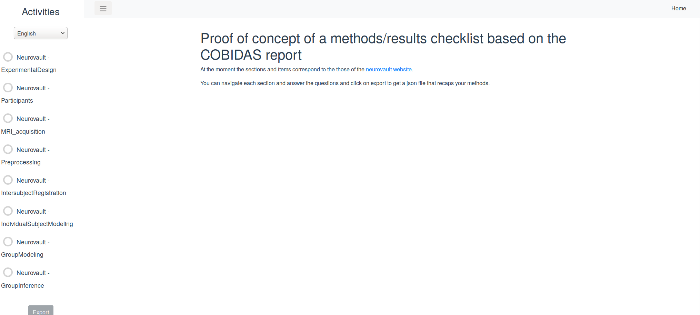

# COBIDAS checklist

This repository host the work turning the report published by the Committee on Best Practices in Data Analysis and Sharing (COBIDAS) of the organization for human brain mapping (OHBM) into a practical tool for improving methods and results reporting in neuroimaging and EEG/MEG.

This repository should be a place where:
1. issues and ideas around reaching this goal are discussed;
2. plans for how to reach this goal may be designed and implemented.

## How to reach us

If you want to kept posted about the progress of the project, you can join our [google group](https://groups.google.com/d/forum/cobidas-checklist).

From more frequent updates and behind the scenes, come and join us on the `cobidas_checklist` channel on the brainhack mattermost.

<a href="https://mattermost.brainhack.org/brainhack/channels/cobidas_checklist"> Join our channel </a>

Otherwise you can open a new issue on the repository itself if there is something you would like to discuss directly here.

## Why this project

Poor methods and results description hinders the reproducibility and the replicability of research. It also makes it hard to compare new and old results and generally increases inefficiency in the research process. This project is built on the hope that improving methods and results reporting could improve our research.

See [here](./why_this_project.md) to for more background information.

## Goals and roadmap

**The short term goal of this project is to make the COBIDAS report easier to use: we want to create a website with a clickable checklist that generates a json file at the end.**

By turning the checklist into a website users could more rapidly click through it and provide more of the information requested by the COBIDAS report. This would generate a small text file (a json file) that summarizes what option was chosen for each item of the checklist. This machine readable file could then be used to automatically generate part of the methods section of an article.

See [here](./goals.md) for more information on our short and long term goals as well as possible extension to the project.

While we are still in development we are also using the [list of required inputs](./xlsx/metadata_neurovault.csv) from [neurovault](https://www.neurovault.org/) to work on the user interface.

## Implementation

So far most of the work is being done on spreadsheets hosted on this [google drive folder](https://drive.google.com/drive/folders/1wg5k-6pSB3mQm_a30abX6qb-lzTn_S-Y?usp=sharing) but you also find recent updates in the [xlsx folder](./xlsx/me).

At the moment we are looking into using the [schema-standardization](https://github.com/ReproNim/schema-standardization) and [schema-ui](https://github.com/ReproNim/schema-ui) initiatives from [ReproNim](http://www.repronim.org/) to structure and render the checklist.

So far we have one [script](./python/create_neurovault_schema.py) to turn the neurovault [list of required inputs](./xlsx/metadata_neurovault.csv) into a schema that can then be render with the schema-ui.

See one example [here](https://schema-ui.anisha.pizza/#/).

See [here](./how_to_render_the_checklist.md) for more information.

Click on the image below to see how the checklist would function.

## How to contribute

We are looking for people to give us feedback or help us move forward and implement all of this.

To learn more about the contributors and how to contribute see [here](./contributors.md).

## References

Jeanette Mumford has a [30 min video](https://www.youtube.com/watch?v=bsM4KowO5Vc&t=175s) explaining the background behind the COBIDAS report and giving a run through of the checklist.

The COBIDAS report:
- [for MRI and fMRI](https://www.biorxiv.org/content/10.1101/054262v2)
- [for EEG and MEG](https://osf.io/a8dhx/)

The original [spreadsheet version](https://osf.io/qkb9t/) of the COBIDAS checklist (thanks to [Cass](https://github.com/cassgvp)!!!)

Presentation slides made about this project can be found in the [presentations folder](./presentations) and [here](./presentations/links.md).
