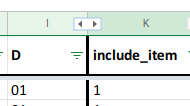

# Spreadsheet content

The spreadsheet aim to have one checklist item (one question) per row. In general it is recommended to NOT hide rows but instead to filter using some of the columns.

Here follows a description of the columns content. If some do not appear it is possible that they have been hidden by someone else. You will simply have to click on the double black arrow at the limit between columns to display them back.

____
1. The firs few columns are only there to try in the future goal to create unique code identifier for each item. This is low priority at the moment so those columns are hidden most of the time.

| Apdx | Act | A1 | A2 | A3 | A4 | A5 | Ref1 | D | Reference |
|------|-----|----|----|----|----|----|------|---|-----------|
|      |     |    |    |    |    |    |      |   |           |

___
2. The following columns can be used to filter which item to display.

| include_item |	neurovault_or_carp | mandatory |
|-|-|-|
| items that include items from `neurovault_or_carp` and some more | items that have their counterpart in the neurovault metadata list and/or that were surveyeed by Carp in 2012 |  items labelled as mandatory in the original COBIDAS report |

{>>Some of the choices for the items to include have been made in pretty arbitrary and one sided manner. This should be discussed further before moving on.<<}

____
3. schema activity name

| activity_name                                                                      |
|------------------------------------------------------------------------------------|
| This corresponds to the main section headings found in the original COBIDAS report |

{>>This might need some discussion too: it is possible that we might gain from splitting some of those into smaller sub-sections.<<}

____
4. item name

The `aspect` column allow for a human readable atomization of each section into items that are organize in a hierarchical fashion.

For example see below

| aspect_1        | aspect_2                                | aspect_3                     | aspect_4          | aspect_5 |
|-----------------|-----------------------------------------|------------------------------|-------------------|----------|
| MRI acquisition | Imaging type                            | partial fourrier scheme      |                   |          |
| MRI acquisition | Essential sequence & imaging parameters | All acquisitions             | voxel dimension   |          |
| MRI acquisition | Essential sequence & imaging parameters | Functional MRI               | number of volumes |          |
| MRI acquisition | Essential sequence & imaging parameters | Inversion recovery sequences | Inversion time    |          |
| MRI acquisition | Essential sequence & imaging parameters | Imaging parameters           | field of view     |          |
| MRI acquisition | Essential sequence & imaging parameters | Slice timing                 |                   |          |

Those columns are then used to create each item name.

| aspect_1 | aspect_2 | aspect_3 | aspect_4 | aspect_5 | item_name                                                      | item_name_duplicate                                                                                                                                                  |
|----------|----------|----------|----------|----------|----------------------------------------------------------------|----------------------------------------------------------------------------------------------------------------------------------------------------------------------|
|          |          |          |          |          | is determined by the content of the right most "aspect" column | each item_name must be unique in the entire column so there is a formula to double that there is no additional occurance of that item name in the rest of the column |

___
5. question	and details

| question	| details |
| _	| _ |
| Each line must correspond to one checklist item that must correspond to only one unambiguous question. Any item that opens the possibility of a response "if A was used then list the parameters B, C, D" must be broken down (atomize) into several questions.  | Some questions might require some additional information to be understandable by all users, so any extra information to be displayed to the users should be put the detail column  |

format	choice_levels	Format2	choices_level2

visibility

SPM defaults	FSL defaults	AFNI defaults

BIDS_status	BIDS_source	BIDS_source_field	NIDMs_results_status	neurovault

in_Carp2012	% of studies that informed it	% of studies that informed it (structural)

use_case_meta-analysis	meta-analysis_comment
